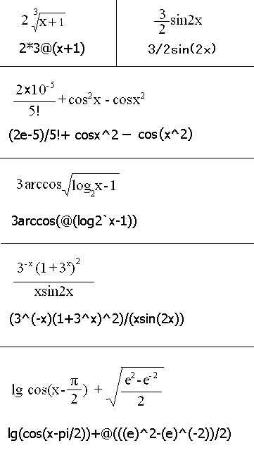

# 方解石数学工具包 使用指南

# 前言

本文提供 方解石数学工具包 (以下简称"方解石") 的使用指南。

本文中的信息（包括引用的 URL 和其他 Internet Web 站点）可能变动，恕不另行通知。

本文档所包含的信息代表作者方解石工作组截至到发布日期对所论述问题持有的最新观点，该观点并不能被视为作者的承诺，并且作者无法保证在发布日期之后所出现信息的准确性。

本文档只用于提供信息。作者不对本文档中的信息作出任何明示、暗示或受法令约束的保证。

遵守任何适用的著作权法是用户的责任。

本文中提到的真实公司和产品的名称可能是其各自所有者的商标。

第三方站点不由作者控制，并且作者不对任何第三方站点的内容、第三方站点包含的任何链接、或第三方站点的任何更改或更新负责。

作者不对从任何第三方站点收到的网站广播或任何其它形式的传输负责。

作者仅为了提供便利的目的而向您提供这些至第三方站点的链接，并且包括某种链接并不暗示作者认可相应的第三方站点。

©2000-2022 方解石工作组 保留所有权利

# 软件简介

方解石数学工具包 为方解石工作组开发的集成了 方程曲线查看器、表达式计算器、解方程（组）、高精度计算、数列求和求积、定积分计算、解三角形、分解质因数、进制转换、求逆矩阵 等诸多组件的轻量级计算工具包。

主要特性:

* 支持40多种函数和8个算术运算符，内建开方(@)运算符、阶乘(!)和以a为底的N的对数 loga`N。
* 支持隐函数、显函数、反函数、导函数图像绘制；
* 支持极坐标系、参数方程；
* 支持使用鼠标平移、缩放、拖动函数图像；
* 高达15位方程(组)的求解精度；
* 解方程时支持根的修正与自动验根；
* 支持任意通项公式数列的求和、求积；
* 支持便捷表达式，允许省略乘号和绝大部分括号；
* 支持多重函数名；
* 支持函数名使用快捷键输入；
* 支持负数开奇次方；
* 支持分步计算显示；
* 支持单变量代入计算；
* 支持无限位四则运算；
* 支持小数转化为分数；
* 支持科学计数法输入；
* 支持批量计算；

## 已知问题

无法完整绘制某些有铅直渐近线的曲线，如 `y=log(x-1)+18` 。

如果绘图精度设置较低，导函数图像可能会参杂多余的线段。

减法运算可能产生不精确的结果，如`1.000000001-1`。

Windows 7 下，若控制面板中设置的屏幕字体缩放比例不是 100%，则界面显示异常。

## 发布

您可以从 <https://github.com/calcitem/MathToys> 获取最新的程序。

如果您对本软件有任何意见和建议，可以通过该网站上公布的电子邮箱地址联系我们。

# 数学表达式概述

本文将多次提到 “数学表达式”，因此您应首先了解这一重要概念。

可使用数学表达式计算数值。数学表达式是包含表示数值的文本以及处理这些值的运算符的表达式。在 方解石中，可在不影响解析的情况下省略部分括号和运算符。

下面是一个数学表达式的示例：

```
4(67+x)
```

等效于:

```
4*(67+x)
```

假定此例中 `x = 2`，此表达式计算为 276，它是 67 加 2 后乘以 4 所得的值。

如果数学表达式包含多个运算符，则它们的计算顺序由运算符优先级的规则确定。若要重写运算符优先级的规则，请将表达式放在括号中，如上面的示例中所示，这样的表达式将首先计算。

## 运算符的有效组合

复杂表达式可包含许多不同的运算符。请考虑下面的语句：

```
f(x)=(45(x+3))^(2/85)5+x
```

创建这样的复杂表达式要求彻底理解运算符优先级的规则。本主题假定您熟悉运算符优先级规则，帮助您构造有效的表达式。

## 数学表达式

在如上述示例所示的数学表达式中，运算符遵循严格的优先级模式。首先，读取所有变量，并执行任何返回值的函数调用。

检索这些值后，依照运算符优先级规则计算表达式。首先执行阶乘运算（`!`），接着执行函数运算，然后是求幂 (`^`, `@`)，接下来是求模(`|`)、乘法 (`*`) 和除法 (`/`,`\`)，它们具有相等的运算符优先级，因此以原文顺序从左向右执行。最后执行加法 (`+`) 和减法 (`-`)。当表达式中出现相等优先级的运算符时，按照运算符的出现顺序从左向右执行计算。

## 算术运算符

算术运算符用于组合数字、数值变量、数值字段和数值函数以得到另一个数字。

算术运算符是加 (`+`)、减 (`-`)、乘 (`*`)、除 (`/`)、整除 (`\`)、求余 (`mod` 或`|`) 和求幂 (`^`,`@`)。

示例

```
7+2*3-2+5^2
```

## 优先顺序

一般情况下，程序按下面的顺序对表达式求值：

从左向右遵循基础数学中的优先规则。

下面是优先顺序从高到低排列的运算符：

1. 阶乘(`!`)

2. 函数(`sin`、 `cos` 、 `sqr` 等)

3. 求幂 (`^`, `@`)

4. 乘, 除, 整除 (`*`, `/`,`\`)和求余 (`Mod`或`|`)

5. 加和减 (`+`,`-`)

示例

从左到右，先进行乘和除运算。然后进行加和减运算。例如，`5 + 10 * 3 = 5 + 30 = 35`。

使用圆括号可以更改优先顺序。例如，`(5 + 10) 3 = 15 * 3 = 45`。如果无法确定优先顺序，一个好办法是用小括号或中括号阐明意图。

## 加括号的表达式

经常需要以不同于运算符优先级所确定的顺序来执行运算。考虑此示例：

```
f(x)=3x+4
```

在此示例中，x 乘以 3，然后将结果加上 4。但是如果希望 x 加上 4 后再乘以 3，该怎么办呢？在这种情况下，可通过使用括号重写常规运算符优先级。通过将表达式放在括号中，强制首先计算该表达式，而不管运算符优先级。

所以，若要强制上述表达式首先计算加法，可以重写该示例，如下所示：

```
f(x)=3(x+4)
```

现在将 x 的值加上 4，然后将该总和乘以 3。

可以将表达式嵌套到多层括号中，以进一步强制优先级。授予括号中嵌套最深的表达式第一优先级，然后是嵌套次深的表达式，等等。请考虑下面的示例：

```
f(x)=(4x)^(x(x+2))
```

此处，x + 2 具有第一优先级，然后是其他加括号的表达式。通常比加法或乘法具有更高优先级的求幂在此示例中最后计算，因为其他表达式都放在括号中。

Mod (`|`) 运算符计算两个操作数相除后的余数。

## * 运算符

将两个数相乘。

```
Expression1 * Expression2
```

结果是 Expression1 和 Expression2 的乘积

注意: 如果*运算符的后面一个字符是字母或括号，则这个*运算符可以被省略。

例如, `sin2*x`可省略为`sin2x`, `3*sin(2*x)` 可省略为 `3sin(2x)`。

## / 运算符
将两个数相除并返回以浮点数表示的结果。

```
Expression1 / Expression2
```

结果是 Expression1 除以 Expression2 的商


## + 运算符

将两个数相加。

```
expression1 + expression2
```

结果是 Expression1 和 Expression2 之和

## - 运算符

产生两个数的差或表示数学表达式的负值。

```
expression1 - expression2
```

结果是 Expression1 和 Expression2 之差。

## ^ 运算符

求以某个数为底、以另一个数为指数的幂。

```
Expression ^ exponent
```

结果值是对以 Expression 为底、以 exponent 为指数进行求幂运算的值。

注意：当 Expression 为负数，而 exponent 为分数（小数）时，只有把 `Expression ^ exponent` 改写为 `Number2 @ (Expression ^ Number1)`, 其中 Number1、Number2 都是整数且 `exponent = Number1 / Number2` 时，才能得到正确结果值。

## @ 运算符

求以某个数为根指数、以另一个数为被开方数的根式的值。

```
Expression1 @ Expression2
```

结果值是对以 Expression1 为根指数、以 Expression2 为被开方数进行开方运算的值

注意：如果 Expression1 的倒数不是整数，那么结果值可能是错误的。

## 字段

`Pi` 表示圆周和其直径的比率，它由常数 `π`指定。
`(e) `自然对数的底数。 注意：括号不能省略。

## 常用函数

```
abs 返回指定数字的绝对值。
arccos 返回余弦值为指定数字的角度。
arcsin 返回正弦值为指定数字的角度。
arctan 返回正切值为指定数字的角度。
cos 返回指定角度的余弦值。
ch 返回指定角度的双曲余弦值。
exp 返回 e 的指定次幂。
log a`x 返回以a为底的x的对数
`（可选）用于分隔真数和底数。
若`省略，则返回指定数字以 e 为底的对数。
lg 返回指定数字以 10 为底的对数。
ln 返回指定数字以 e 为底的对数。
sgn 返回表示数字符号的值。
sin 返回指定角度的正弦值。
sh 返回指定角度的双曲正弦值。
sqr 返回指定数字的算术平方根。
tan 返回指定角度的正切值。
th 返回指定角度的双曲正切值。
```

## 全部函数

以下为 方解石 支持的所有函数列表，其中有多个函数具有相同的功能，用 `/` 分隔开。

```
abs 绝对值
exp/ep 　指数函数(以e为底)
fix/trunc  整数部分  　
int   不大于x的最大整数
log a`x 以a为底的x的对数    `用于分隔真数和底数。
ln/log 以e为底的对数(自然对数)
lna   先取绝对值，再计算自然对数。lnax 等效于 ln (absx))
lg   以10为底的对数(常用对数) sgn 符号函数
sqr 开平方
sin 正弦
cos 余弦
tan/tg 正切
cot/ctg 余切
sec 正割
csc 余割
arcsin/asin 反正弦
arccos/acos 反余弦
arctan/arctg/atan/atn 反正切
arccot/arcctg/acot 反余切
arcsec/asec 反正割
arccsc/acsc 反余割
sh/sinh 双曲正弦
ch/cosh 双曲余弦
th/tanh 双曲正切
cth/coth 双曲余切
sech 双曲正割
csch 双曲余割
arsh/asinh 反双曲正弦
arch/acosh 反双曲余弦（正值）
arth/atanh 反双曲正切
arcth/acoth 反双曲余切
arsech/asech 反双曲正割（正值）
arcsch/acsch 反双曲余割
n! n的阶乘
deg 转化为用度表示的格式
dms 转化为用度-分-秒表示的格式
round 四舍五入到个位
```


## 转换、舍入和截断

当您调节保留的小数数位后，方解石 将对该数进行舍入。如何舍入将取决于紧挨小数点右边的数字的值 - 小于 5 的数字舍去，而大于 5 的数字则进上去。

如果该数字为 5，那么紧挨小数点左边的数字为偶数时舍去，奇数时进上去。当要舍入的数字为 5 时，结果始终为偶数。

如果要舍弃某个数的小数部分，而返回整数部分，则可以使用 int 或 fix 函数。这两个函数将简单截断而不进行舍入。例如， `int(8.5)` 返回 8， `int(9.5)` 返回 9。 int 和 fix 功能表现相同，除非处理的是负数。 int 函数舍入到较小的负整数，而 fix 函数舍入到较大的负整数。

例如，下列表达式求得的值为 “-8”：

 ```fix(-8.2)```

另一方面，使用 Int 函数，结果将为“-9”：

``` int(-8.2)```

## 表达式示例



合法的表达式：

```
2(abs5+3)-3sqr4
3*@2
2*(abs5+3)-3*sqr4
[3^2-4*3+4)/(2@3]  注意：圆括号等效于中括号。
(-1/3)@(16*2^2-4/2(3^4+2/3))/[56\3]
sin30cos60
sin(cos45)
(3E+6)(-4E-3)
注意：aE+b 即 a*10^b (a乘以10的b次幂), 因此 3.14E-16 表示 3.14*10^(-16)。
sin(-2-18)
sin(pi)
4(5-6)(6^(-7))
sin(pi/2)cos(pi*3/2)
tg1tan2ctg3
lg0.1+log2`4-ln3 注意: 此处用了 ` 分隔真数和底数
2!+ 3!-4!
sin(-45)(-cos60)
sin(dms(40.45))
3-4)(4/5
(3-4)5
(1-3)sin30
sinx
siny
sinpi
sint
(e)^x
```

不合法的表达式

```
2^-3, 应改为 2^(-3)
5*-6，应改为 5*(-6)
Sin-30, 应改为 sin(-30)
e^(-x), 应改为 (e)^(-x)
sincos30, 应改为 sin(cos30)
pisin30, 应改为 (pi)sin30
```

注意：

`2/3sinx`等价于`2*sinx/3`，而不是`2/(3sinx)`.

`sin2x`等价于`(sin2)x`，而不是`sin(2x)`.

`sinx^2`等价于`(sinx)^2`,而不是`sin(x^2)`.

`[]`与`()`等效。

`pi`后若是数字或函数，则`pi`与该数字（函数）间的乘号不能省略。

# 应用介绍

下面介绍 方解石 集成的各个主要应用的使用方法和注意事项。限于篇幅，本文档未对所有应用进行介绍，大多数情况下，您可以通过将鼠标悬停在各个配置框上，获取有关该配置项的描述。

## 主窗口

单击主程序文件，出现主窗口。

点击上方 方解石 字样，则弹出主菜单，包含了常用用的子程序。

在输入框中输入表达式，再分别点击下方三个应用 (表达式计算器、函数图像绘制、解一元方程) 的图标，这些应用将加载输入的表达式进行处理。您也可以直接点击这三个图标进入应用之后再输入表达式。

关闭主窗口，则结束 方解石 所有的子线程，释放物理内存。


## 科学计算器

使用计算器可以执行高级的科学计算。

当鼠标在某一对象上暂停时，会显示这个对象的提示。

单击“最大化”按钮查看扩展视图。

单击表达式输入区，当有光标闪烁时，用键盘输入数学表达式(运算符和数据的组合)或单击按钮输入相应的字符。

常用函数 `sin`、`cos` 、`tan`、`cot`、`exp`、`log`、`arc` 和常量`(e)` 可分别用上档键  `[Shift]` + `S`、`C`、`T`、`O`、`X`、`L`、`A`、`E` 输入。

单击 `=` 或直接回车查看计算结果。此时计算结果显示区显示计算结果，表达式显示区显示表达式。

可以对任何显示区中的文本进行剪切、复制、粘贴操作。

当表达式输入区内光标闪烁时，按 `Esc` 键清除表达式。

单击 `MS` 可以把计算结果存入存储器。

在表达式中可以分别用  `(M)`、`(ML)`、`(MR)` 表示当前计算结果（计算结果显示区内的数字）、上次计算结果和存储器中的数。

如果您需要保存以后输入的表达式和数据，那么请钩选“写记录文件”; 取消小钩则此后程序将不再在 `Calc.txt` 文件中写入数据。

若要执行批量计算, 则应先建立一文本文件, 打开此文本文件, 在每一行输入一个表达式(不要有空行), 保存文件, 然后运行程序, 单击“批量计算”, 在打开对话框中选择此文件, 单击`[确定]`, 程序将把计算结果写入和此文件在同一目录下的 `Output.txt` 文件。在批量计算中，有些行若不想计算它，请在这一行前加上 `#`。

最大化窗口后，拖动窗口右上角的滑杆可以调整运算精度, -1表示有效数字为15位, 0~6表示保留几位小数, 7表示有效数字为7位。

最大化窗口时，右侧显示表达式分步计算的结果。

## 高精度计算

### 大数计算器

大数计算器可执行简单的大数计算，其计算结果的有效数字为64位。

单击数字键输入计算的第一个数字。

单击`+`执行加、`-`执行减、`*`执行乘、`/`执行除，`√`执行开平方。

单击数字键输入计算的下一个数字。

输入所有剩余的运算符和数字。

单击`=`。

注意：当显示“请稍候...”时关闭窗口，则大数计算器并未被彻底关闭，只是被隐藏起来。您可以单击主菜单上的“大数计算器”重新显示窗口。

您只能通过关闭主菜单来彻底关闭大数计算器。

### 高精度计算器

高精度计算器是大数计算器的改进版。对于除和开方计算，可设置计算结果的有效数字应保留的位数。对于其他计算，无须设置有效数字的位数。

## 方程曲线查看器

当鼠标在某一对象上暂停时，会显示这个对象的提示。

在曲线方程输入区输入曲线方程，回车，图像显示区将显示方程曲线。

双击曲线方程输入区左方的 `y=`，就切换到隐函数模式。

常用函数 `sin`、`cos` 、`tan`、`cot`、`exp`、`log`、`arc` 和常量`(e)` 可分别用上档键  `[Shift]` + `S`、`C`、`T`、`O`、`X`、`L`、`A`、`E` 输入。

按 Esc 键清除图像。

可用鼠标右键拖动图像以改变显示范围，单击右键恢复到拖动前的图像。

单击曲线方程输入区左方的按钮或按 F10 弹出主菜单。

如果显示速度较慢或者绘图精度不足，请调节绘图精度。

在显示卡品质不高的情况下，写内存绘图模式较写屏幕模式提速明显，但不能动态显示绘图过程。

把鼠标移至图像显示区的左侧，就弹出了显示范围菜单。若要恢复显示范围默认设置，请双击菜单的空白处。

注意 `Xmax`、`Xmin` 等字样都是可以单击的对象，要了解单击的作用，可将鼠标移到这些字样上并暂停片刻。

在隐函数模式下，若您在曲线方程输入区中输入的是不含`=`号表达式 Expression，则图像显示区显示方程`Expression=0` 的曲线。若你输入的是含`=`号表达式 `Expression1=Expression2`，则图像显示区显示方程 `Expression1-Expression2=0`的曲线

形如 `6x^3-4x^2+x-5` 的一元n次多项式可以用 `6 -4 1 -5` 代替。

局部放大：按住 Alt 键不放，鼠标点击图像某一点，程序将以此点为中心放大图像。

整体放大：鼠标中间按钮；整体缩小：Alt + 鼠标中间按钮

解析式标注：按住 Shift 和 Ctrl 键不放，鼠标点击需要标注解析式的位置。

拟合与插值: 按提示依次输入节点坐标. 按 Esc 或直接回车结束输入，若输入 `b` 则跳回上一个节点。

如何画直线

(1) 按住 Ctrl 键不放，鼠标点击直线起点。

(2) 释放 Ctrl 键，再按住Shift键不放，鼠标点击直线终点画出直线。此后起点自动变为终点。要重定义起点，请重复 (1) 过程。

按下鼠标左键，显示光标位置线。

 注意：

允许在 “总和与连乘” 中使用小数作为参数，但不保证其运算的准确性，某些情况下误差会很大。建议不要使用小数作为参数。

所有的快捷键只有在曲线方程输入区具有焦点，即其内部的光标闪烁时才起作用。


## 解一元方程

在 `=0` 前的文本框输入表达式，中间不能有空格，未知数只能是 `x`。然后回车。下方将显示该方程式在设定的根的区间内的所有根以及根的个数。

常用函数 `sin`、`cos` 、`tan`、`cot`、`exp`、`log`、`arc` 和常量`(e)` 可分别用上档键  `[Shift]` + `S`、`C`、`T`、`O`、`X`、`L`、`A`、`E` 输入。

如果表达式中无 `=`，则一元方程求解器求解的方程式是 `输入的表达式` + `=0`。例如，输入`x+1`，则求解的方程式是 `x+1=0`，结果为 `-1`。

如果表达式中有`=`，则一元方程求解器求解的方程式是`输入的表达式`。例如，输入`x+1=2`，则求解的方程式是`x+1=2`，结果为`1`。

建议在求解方程 `f(x)=0` 前先查看 `y=f(x)` 的图像，以查明实零点的分布情况。其方法是先在 `=0` 前的方程输入框输入方程式，再按F5。

如果您对求解结果不满意，请调节求解精度、步长、根的区间或者修改方程。

求解精度值为n,则根精确到10的n次方。

步长越大，求解速度越快。但步长不应大于两相邻实零点的最短距离，否则会漏解。

例如，求解`sinx=0`时，步长应小于3.14。

根的区间决定所求根的范围。

当`y=f(x)`的图像与x轴相切，而非相交时，极有可能漏解。在此情形下，您可以把方程 `f(x)=0`修改为 `f(x)=ε`, `ε`是一个绝对值充分小的数，其符号和大小可变，直至对求解结果满意为止。

## 解实系数线性代数方程组

在左边的文本框内输入方程组的系数矩阵。 元素按行存放,元素间用空格隔开。

求解完毕后右方将显示方程组的解。

## 求逆矩阵

在左边的文本框内输入矩阵。 元素按行存放。

元素间用空格隔开，输入一行矩阵完毕后，回车跳转到下一行继续输入。

单击“求解”按钮查看逆矩阵。

## 解三角形

在上方的白色文本框中输入三角形六个特征元素值中的三个。

a、b、c、A、B、C 分别表示a 边、b边、c边、角A、角B、角C 的长度或大小。

单击“求解”，白色文本框中显示该三角形全部六个特征元素值。

下方的灰色文本框依次显示该三角形a边上的高、中线，角A的平分线以及该三角形面积、外接圆半径、内接圆半径的大小。

单击“重置”清除所有文本内容。

您可以选择特征元素值的输入格式。这些格式包括：度、度-分-秒、弧度。

示例：

1. 度  123.56789表示123.56789度

2. 度-分-秒  123.56789表示123度56分78秒9

3. 弧度 123.56789表示123.56789弧度

## 显函数求导器

导数在实践中应用广泛。显函数求导器根据基本初等函数的导数公式和函数的求导法则，求出显函数 `f(x)=0` 的导数。

应该指出，有的初等函数在某些点处的导数不能由显函数求导器求得，而只能由导数的定义直接去求，如 `cos (3@(x^2))`等。

使用方法：

输入数学表达式，并回车，即显示求导结果。

按 Esc 清空表达式输入区。

求导器只对 x求导。

注意：这里不支持 `\`和`|`两个运算符；支持的函数仅有： ln 、 lg 、exp、sin、 cos 、tan、sec、 csc 、 arcsin 、 arccos 、 arctan 、 arccot 、 arcsec 、 arccsc 、 sh 、 ch 、 th 、 cth 、 sech 、 csch 、 arsh 、arch、 arth 、 arcth